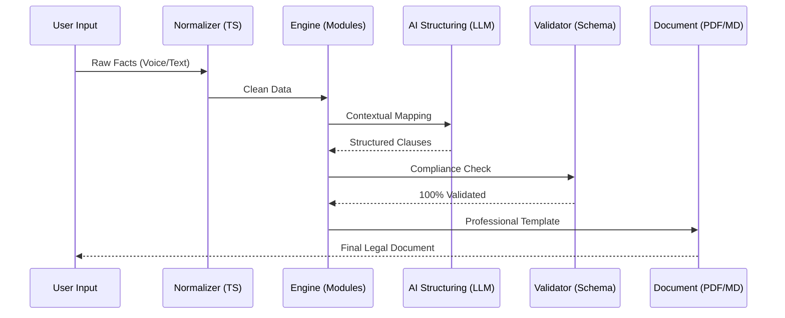

<div align="center">
  

  # MURDOCK
  ### Legal Infrastructure as a Public API

  [](LICENSE)
  [](https://murdock-v1.netlify.app/)
  [](https://github.com/adisingh-cs)

  **"A fighting chance in YOUR legal system."**
</div>

---

## ⚖️ The Mission

Justice shouldn’t be a premium product; it should be a public API. 

Murdock is building the **open-source engineering layer** between a citizen's problem and a professionally structured legal document. We don't replace lawyers—we replace the tedious, manual, and expensive drafting process that keeps 90% of Indians stuck in the "Reality Gap."

## 🏗️ Technical Architecture

Murdock is built as a modular pipeline that isolates complex legal logic from the interface. It turns messy, unstructured facts into high-fidelity, compliant legal JSON.



## 🛠️ Tech Stack

Built with a focus on precision, speed, and auditability:

- **Frontend**: `React 18` + `Vite` + `Tailwind CSS v3.4`
- **Animations**: `Framer Motion` + `Three.js` (Low-latency visual feedback)
- **UI Components**: `Radix UI` + `Shadcn UI`
- **Infrastructure**: `FastAPI` + `PostgreSQL` + `Docker`
- **AI Layer**: Provider-agnostic orchestration (GPT-4o, Claude 3.5, Gemini Pro)

## 📦 Plugin Ecosystem

Murdock treats every law as an independent module. Adding support for a new legal domain requires zero changes to the core engine.

| ID | Module Name | Law Reference | Status |
|:---|:---|:---|:---|
| **M-01** | **Consumer Protection** | CPA 2019 | ✅ Active |
| **M-02** | **Housing & Rent** | Rent Control Act | ✅ Active |
| **M-03** | **Employment Hub** | Factories Act / LC | 🚧 Planned |
| **M-04** | **RTI Automator** | RTI Act 2005 | 🚧 Planned |

## 🚀 Getting Started

### Prerequisites
- Node.js (v18+)
- npm / pnpm / yarn

### Installation
1. Clone the repository:
   ```bash
   git clone https://github.com/adisingh-cs/Murdock.git
   ```
2. Install dependencies:
   ```bash
   npm install
   ```
3. Start the development server:
   ```bash
   npm run dev
   ```

## 🤝 Contributing

We are building in public. We welcome contributions in:
- **Legal Modules**: Defining new JSON schemas for specific laws.
- **Localizations**: Translating document templates into regional languages.
- **AI Bridges**: Implementing new LLM provider interfaces.

## 📄 License

This project is licensed under the **Apache License 2.0**. See the [LICENSE](LICENSE) file for details.

---

<div align="center">
  <p>Built with ❤️ by <b>Aditya Singh</b></p>
  <p>
    <a href="https://github.com/adisingh-cs"></a>
    <a href="https://x.com/adityas_ae"></a>
    <a href="https://www.linkedin.com/in/adityas-ae/"></a>
  </p>
</div>
