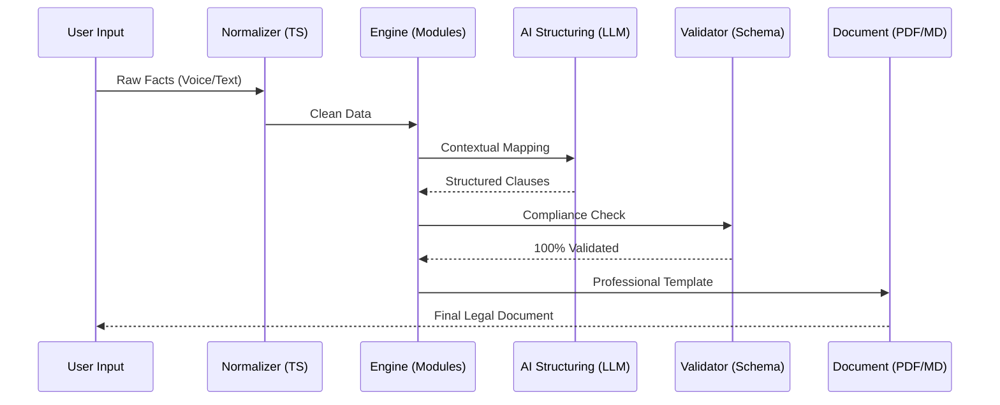

<div align="center">
  

# MURDOCK

### AI-Powered Indian Legal Document Compiler

[](LICENSE)
[](CONTRIBUTING.md)
[](https://murdock-v1.netlify.app/)

**"A fighting chance in YOUR legal system."**

</div>

---

## ⚖️ The Mission

Murdock enables Indian citizens, lawyers, businesses, and developers to generate legally structured, court-acceptable plain-paper documents using AI assistance.

## 🏗️ Technical Architecture

Murdock is built as a modular pipeline that isolates complex legal logic from the interface. It turns messy, unstructured facts into high-fidelity, compliant legal JSON.



## 🛠️ Tech Stack

Built with a focus on precision, speed, and scalability:

* **Frontend:** `React 18` + `Vite` + `Tailwind CSS` + `shadcn/ui` + `Framer Motion`
* **Authentication:** `Supabase Auth`
* **Backend APIs:** `Netlify Functions (Node.js/TypeScript)`
* **Database:** `Supabase PostgreSQL`
* **Infrastructure:** Fully serverless (Netlify + Supabase)

## 📦 Core Features

* **7 Core Legal Modules:** Consumer Complaints, RTI Applications, Legal Notices, FIR Drafts, Employment Grievances, Rental Disputes, Banking/UPI Frauds
* **Multilingual Support:** English, Hindi, Marathi, Gujarati with localized legal glossaries
* **Async AI Generation:** Queue-based processing using Netlify Background Functions
* **Secure Authentication:** Role-based access via Supabase Auth
* **Zero-Infra Architecture:** Fully serverless deployment

## 🚀 Getting Started

### Prerequisites

* Node.js (v18+)
* npm / pnpm / yarn

### Installation

1. Clone the repository:

   ```bash
   git clone https://github.com/adisingh-cs/Murdock.git
   ```
2. Install dependencies:

   ```bash
   npm install
   ```
3. Start the development server:

   ```bash
   npm run dev
   ```

> [!TIP]
> Create a `.env.local` file with your `VITE_SUPABASE_URL` and `VITE_SUPABASE_ANON_KEY`.

## 🌐 Deployment (Netlify)

### Environment Variables

```env
# Supabase Keys
VITE_SUPABASE_URL=your_project_url
VITE_SUPABASE_ANON_KEY=your_anon_key
SUPABASE_SERVICE_ROLE_KEY=your_service_role_key

# AI Provider Key
OPENAI_API_KEY=your_openai_api_key
```

### Build Settings

* **Build Command:** `npm run build`
* **Publish Directory:** `dist`

## 🤝 Contributing

We are building in public. We welcome contributions from both developers and legal experts:

* **Coders:** Build new legal modules or improve AI pipelines
* **Lawyers:** Validate and improve legal accuracy across jurisdictions

**Please read our [CONTRIBUTING.md](CONTRIBUTING.md) for detailed guidelines.**

## 📄 License

This project is licensed under the **Apache License 2.0**. See the [LICENSE](LICENSE) file for details.

---

<div align="center">
  <p>Built with ❤️ by <b>Aditya Singh</b></p>
  <p>
    <a href="https://github.com/adisingh-cs"></a>
    <a href="https://x.com/adityas_ae"></a>
    <a href="https://www.linkedin.com/in/adityas-ae/"></a>
  </p>
</div>
